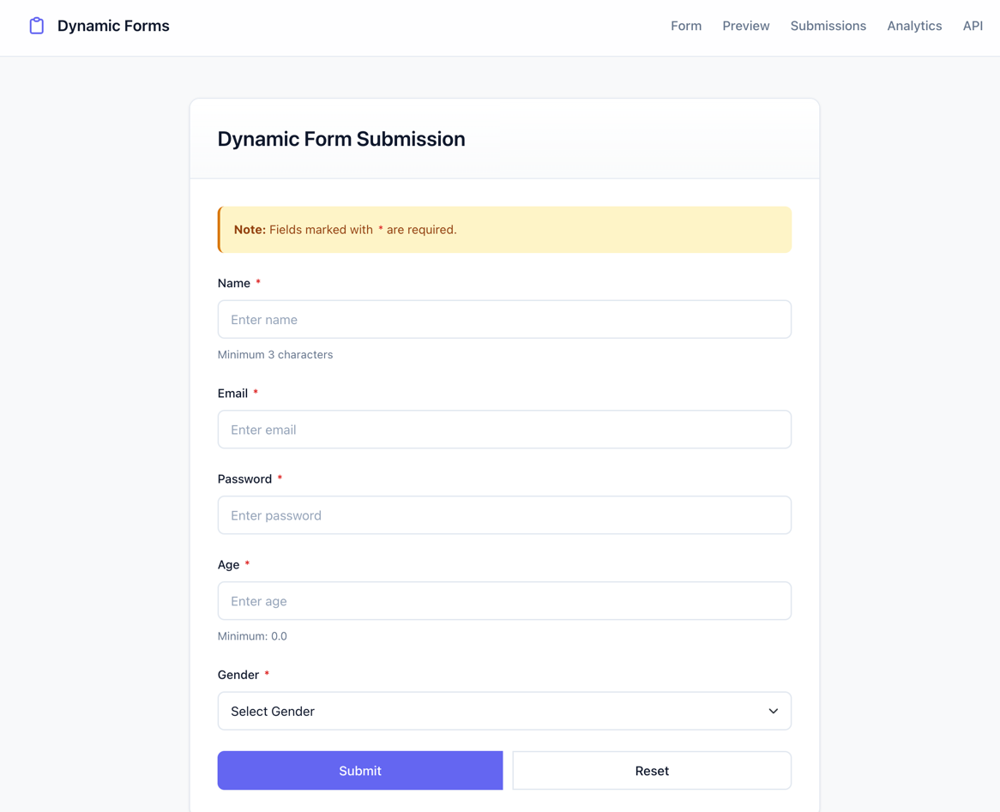
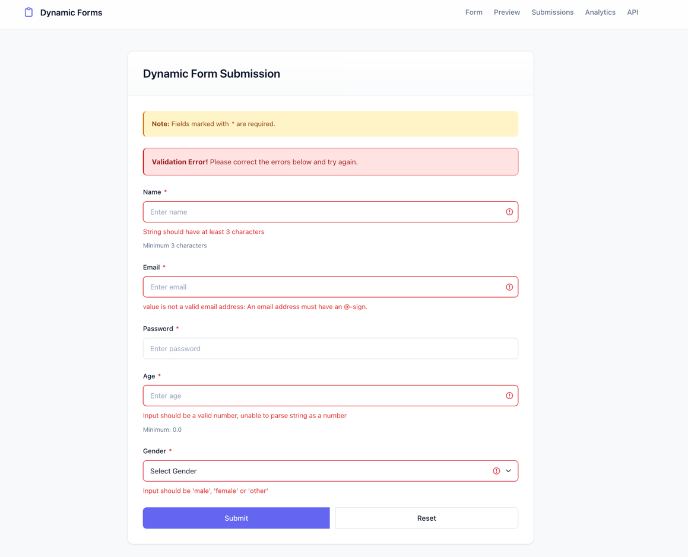
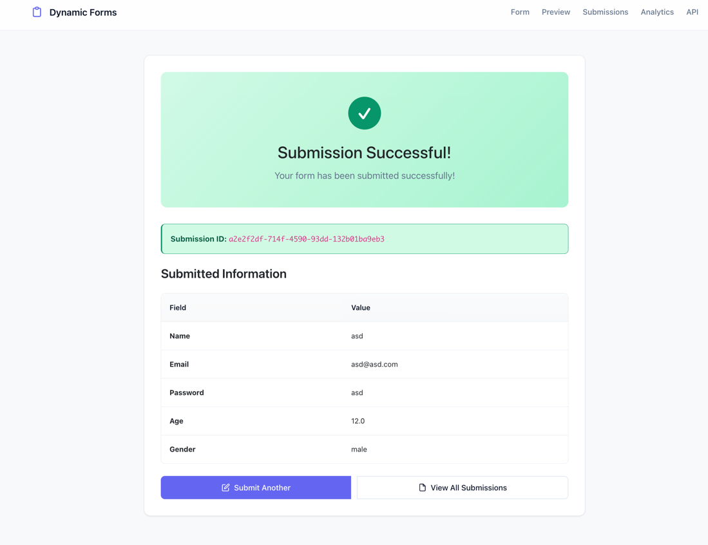
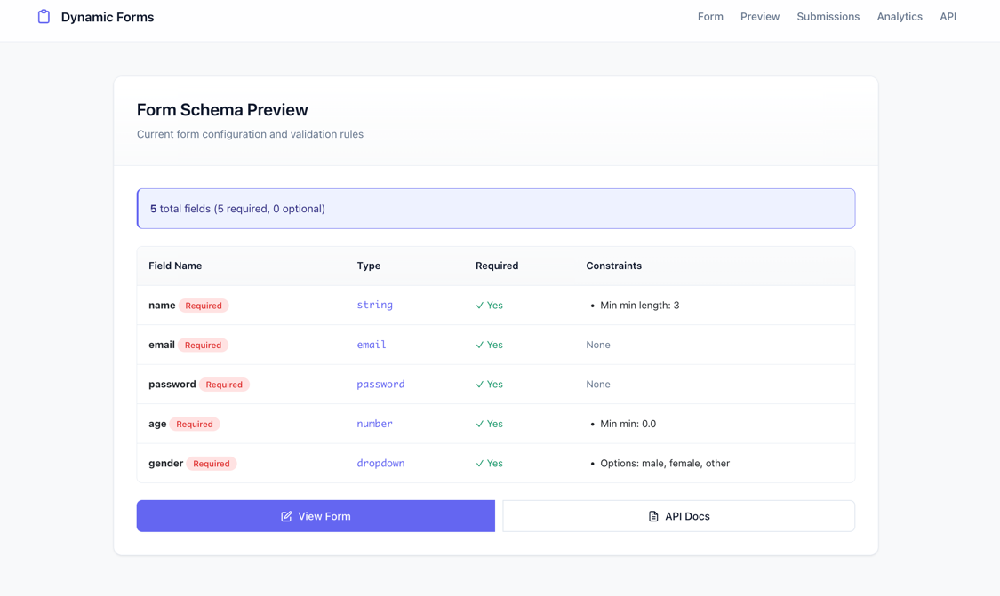
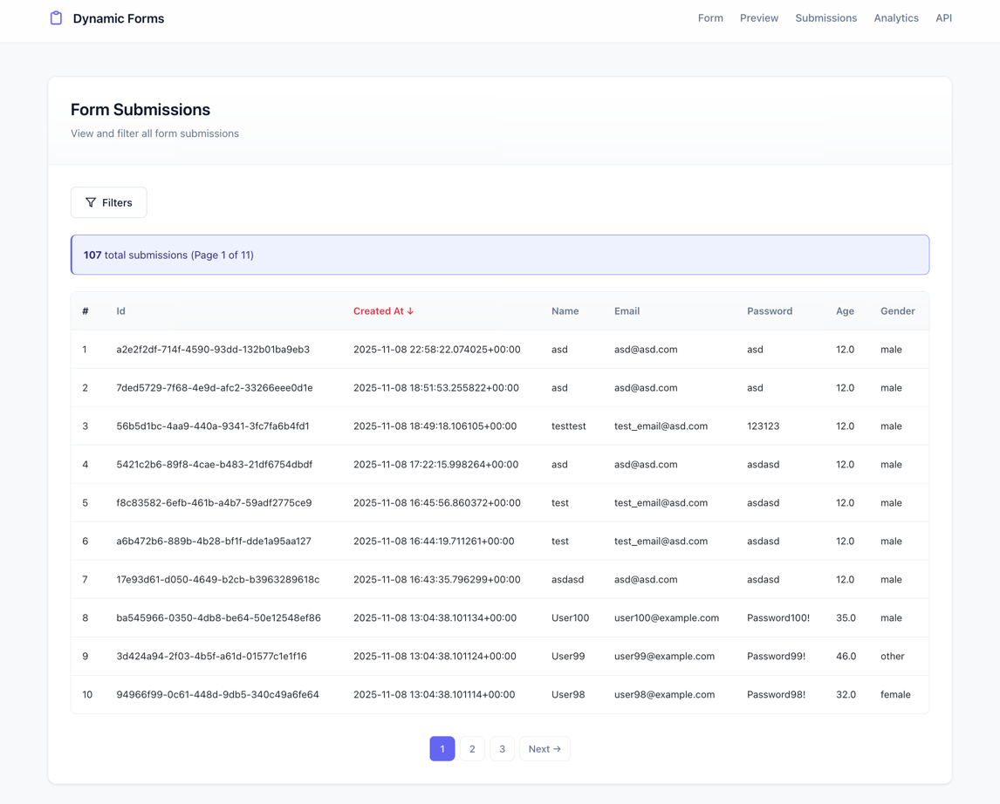
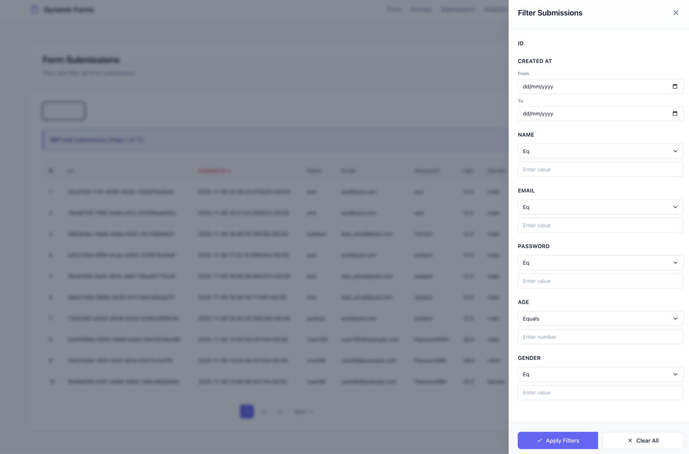
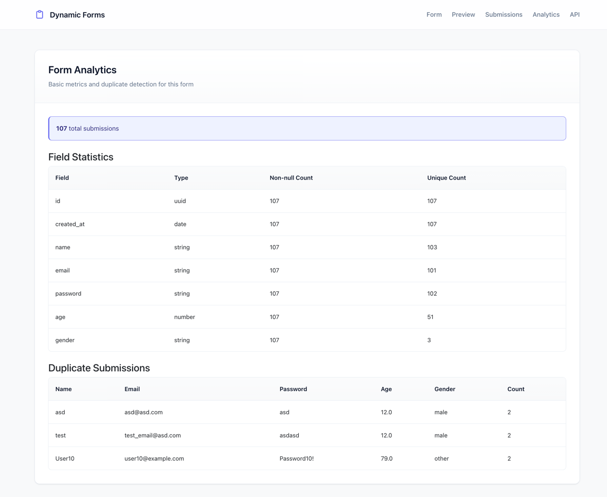

# Dynamic Form System

A flexible and dynamic form system built with FastAPI, SQLAlchemy, and Jinja2 that allows for runtime form generation
and data collection based on JSON schemas.

## Features

- **Dynamic Form Generation**: Create forms at runtime using JSON schema definitions
- **Database Integration**: Automatically creates and manages database tables based on form schemas
- **RESTful API**: Fully-featured API for form submission and data retrieval
- **Responsive UI**: Clean, responsive form interface built with modern web standards
- **Schema Validation**: Built-in validation using Pydantic models
- **Async Support**: Built with async/await for high performance

## Tech Stack

- **Backend**: FastAPI
- **Database**: PostgreSQL with SQLAlchemy ORM
- **Templating**: Jinja2
- **Async**: asyncpg, SQLAlchemy 2.0 async
- **Testing**: pytest, pytest-asyncio

## Prerequisites

- Python 3.8+
- PostgreSQL 12+
- pip (Python package manager)

## Installation

1. **Clone the repository**
   ```bash
   git clone https://github.com/talhrmn/DynamicFormSystem.git
   cd DynamicFormSystem
   ```

2. **Create and activate a virtual environment**
   ```bash
   python -m venv venv
   source venv/bin/activate
   ```

3. **Install dependencies**
   ```bash
   pip install -r requirements.txt
   ```

4. **Set up environment variables**
   Create a `.env` file in the root directory and fill in the necessary variables.
   You can use the .env.example file as a template.

## Running the Application

1. **Start the development server**
   ```bash
   uvicorn app.main:app --reload
   ```

2. **Access the application**
    - API Documentation: http://localhost:8000/docs
    - ReDoc Documentation: http://localhost:8000/redoc
    - Web Interface: http://localhost:8000/api/v1/jinja/form/

## Project Structure

```
dynamic-form-system/
├── app/
│   ├── common/           # Common utilities and helpers
│   ├── core/             # Core application configuration
│   ├── database/         # Database models and connection
│   ├── form_schemas/     # JSON schema definitions
│   ├── jinja/            # Templates and static files
│   ├── repositories/     # Data access layer
│   ├── services/         # Business logic layer
│   ├── views/            # API routes
│   └── main.py           # Application entry point
├── tests/                # Test files
├── .env                  # Environment variables
├── .gitignore
├── requirements.txt      # Python dependencies
└── README.md
```

## Defining Forms

Forms are defined using JSON schema. Example schema (`app/form_schemas/schema.json`):

```json
{
  "name": {
    "type": "string",
    "required": true,
    "minLength": 3
  },
  "email": {
    "type": "email",
    "required": true
  },
  "age": {
    "type": "number",
    "required": true,
    "min": 0
  },
  "gender": {
    "type": "dropdown",
    "options": [
      "male",
      "female",
      "other"
    ],
    "required": true
  }
}
```

### Database Migrations

Make sure you have a database running and the connection string is correct in the .env file.
If you change the JSON schema, you must change the table name to avoid conflicts.

### Tests

To run the tests, use the following command:

```bash
pytest tests
```

### To Do

- Add support for more field types
- Add support for more validation rules
- Add support for more authentication methods
- Add support for more storage
- Add support for more languages
- Add more test coverage
- Improve error handling
- Add better database management and migrations

## Images

### Form



### Errors



### Success



### Preview



### Submissions



### Filters



### Analytics

